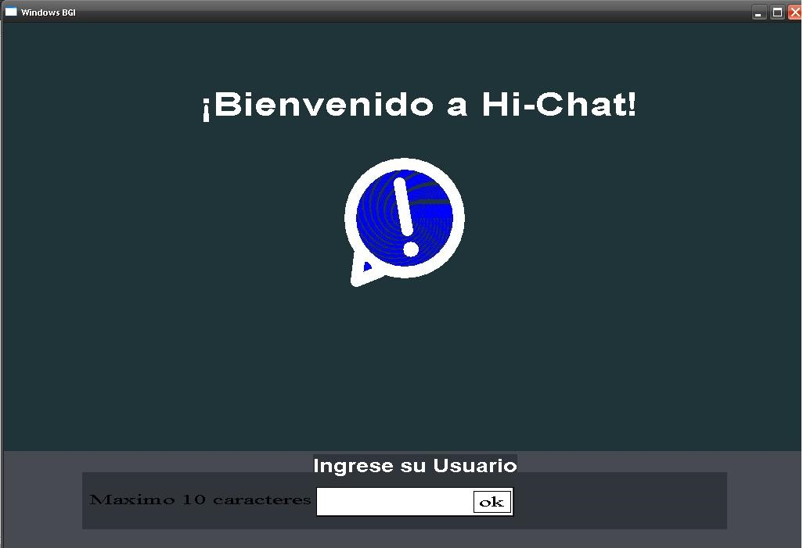
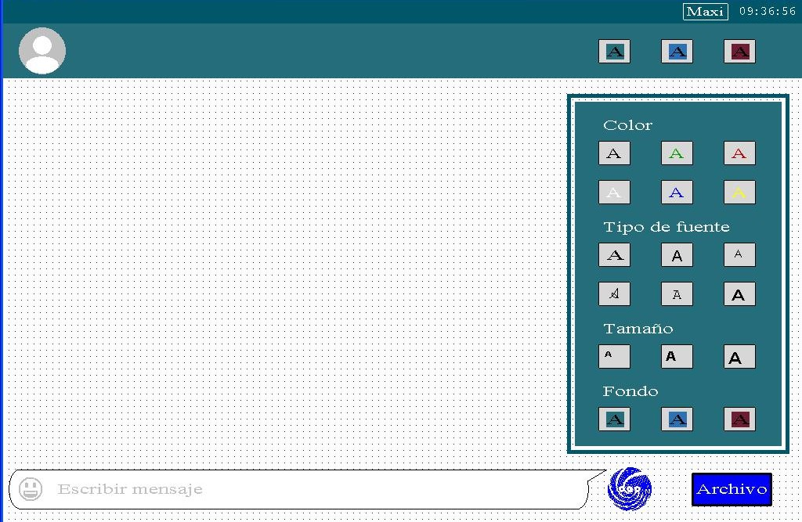
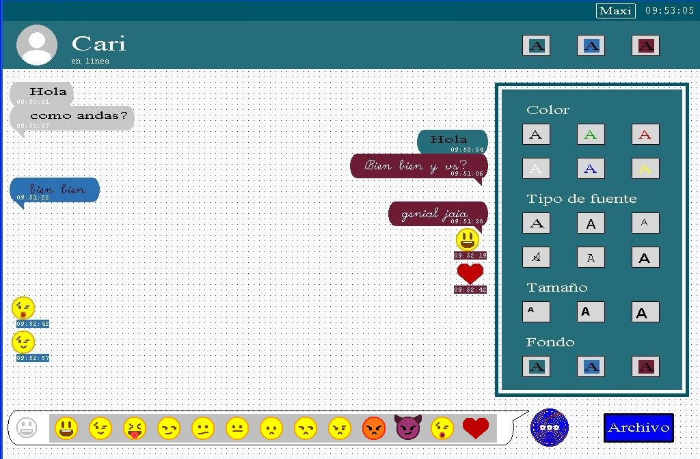

# 💬 HI Chat – Comunicación serial en C++ con interfaz gráfica

**Autor:** [Maximiliano Guzmán](https://www.linkedin.com/in/maximiliano-guzm%C3%A1n-bb3392174)  
**Lenguaje:** C++  
**Entorno de desarrollo:** Dev-C++  
**Librerías:** `winbgim.h`, `windows.h`

---

## 🧩 Descripción

**HI Chat** es una aplicación desarrollada en **C++** con el propósito de mejorar mis habilidades en el lenguaje y explorar la comunicación de bajo nivel entre **hardware y software**.  
El proyecto permite establecer comunicación bidireccional entre dos computadoras a través de un **puerto serie (RS-232)**, y cuenta con una **interfaz gráfica creada con WinBGIm** que muestra los mensajes transmitidos en tiempo real.  

Este desarrollo me permitió profundizar en temas como el manejo de puertos, estructuras de control, sincronización y programación gráfica, integrando conceptos teóricos con una aplicación práctica completa.

---

## ⚙️ Características principales

- 🔌 Comunicación serial por puerto **RS-232** (COM)
- 💻 Interfaz gráfica con **WinBGIm**
- ⏱️ Detección de conexión entre usuarios en tiempo real
- 📝 Envío y recepción de mensajes por puerto serie
- 🎨 Personalización de colores y emojis
- 📁 Creación de archivo `.txt` con mensajes predefinidos
- 🕒 Visualización de hora en tiempo real
- 🚪 Cierre de sesión mediante tecla *Escape (Esc)*

---

## 🧱 Arquitectura técnica

El programa trabaja con funciones del sistema operativo para el manejo de puertos:

- `CreateFile`, `WriteFile`, `ReadFile` → envío y recepción de datos  
- `COMMTIMEOUTS` → control de tiempos de espera  
- `kbhit()` → detección de entrada de teclado  
- Librería `winbgim.h` → interfaz gráfica y eventos de mouse  

La comunicación entre computadoras se realiza mediante un cable **DB9 hembra-hembra**, con pines cruzados entre `TX` (3) y `RX` (2), y `GND` (5).

---

## 🖼️ Capturas

| Pantalla de inicio | Chat principal | Opciones y emojis |
|--------------------|----------------|-------------------|
|  |  |  |

*(Imágenes tomadas del informe original del proyecto)*

---

## 🧾 Documentación

Podés consultar el informe técnico completo del proyecto en:  
📄 [`docs/HI-CHAT_Informe.pdf`](docs/HI_CHAT_Informe.pdf)

---

## 💡 Aprendizajes clave

- Profundización en **C++ orientado al hardware**  
- Implementación de **comunicación serial (RS-232)**  
- Diseño de interfaces gráficas sin frameworks modernos  
- Sincronización entre procesos y control de tiempo real  
- Comprensión del flujo de datos entre software y dispositivos físicos  

---

## 🧰 Herramientas utilizadas

- Dev-C++  
- WinBGIm  
- Windows API  
- Cable DB9 serie (RS-232)

---

## 🔮 Próximos pasos

- Modernizar el proyecto en **Qt o C#** para entornos actuales  
- Simular la comunicación serial mediante software  
- Mejorar la interfaz con nuevas librerías gráficas  

---

## 🪪 Licencia

Este proyecto está disponible bajo la [licencia MIT](LICENSE).

---

> ✨ Proyecto desarrollado por [Maximiliano Guzmán](https://www.linkedin.com/in/maxiguzman17).  
> Creado con el objetivo de fortalecer mis conocimientos en C++ y comunicación entre software y hardware, hoy forma parte de mi portfolio técnico.
